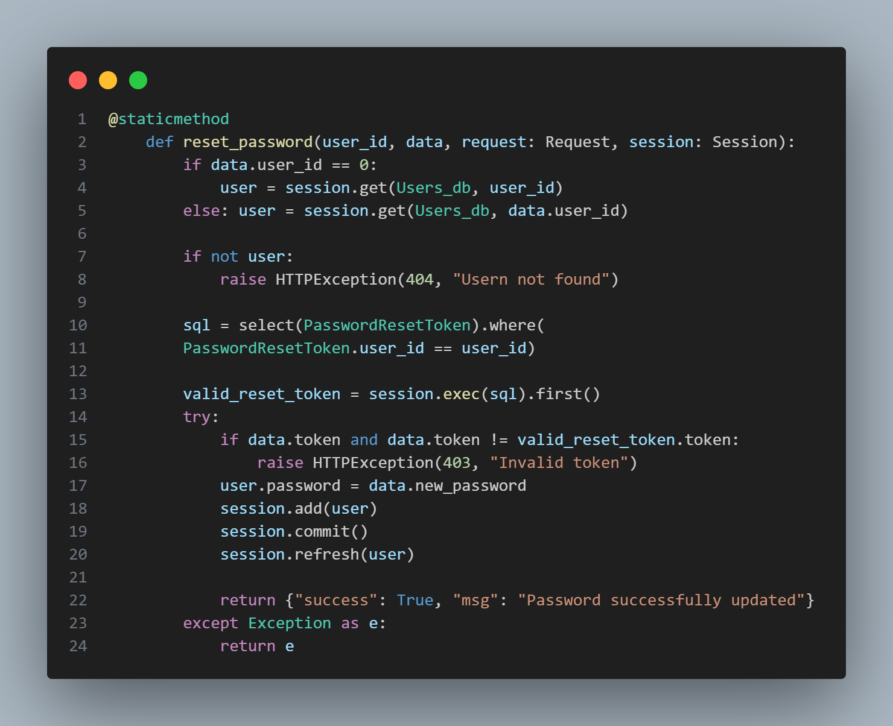
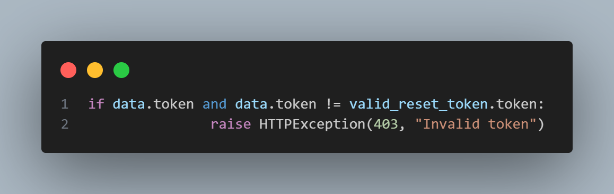
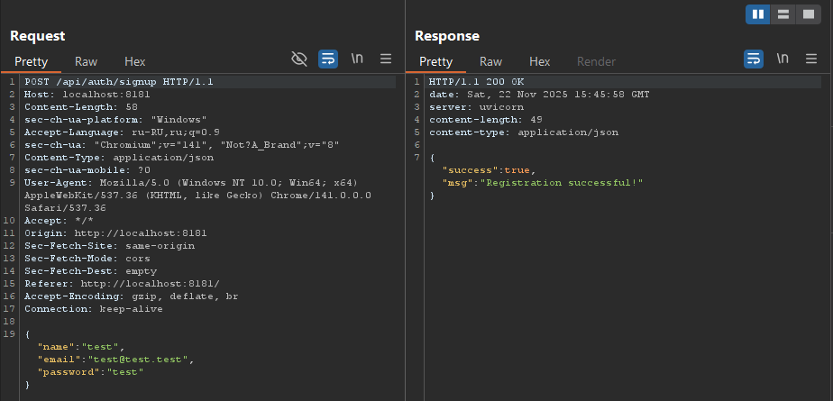
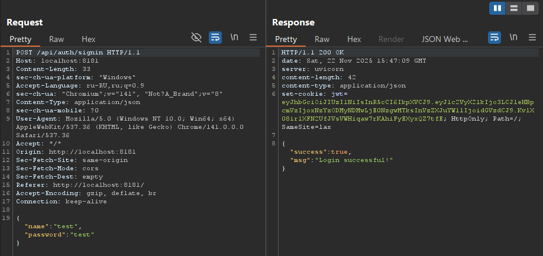
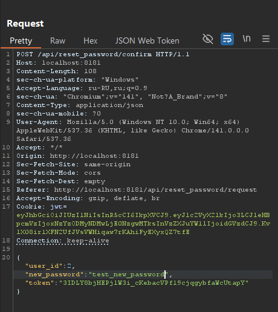
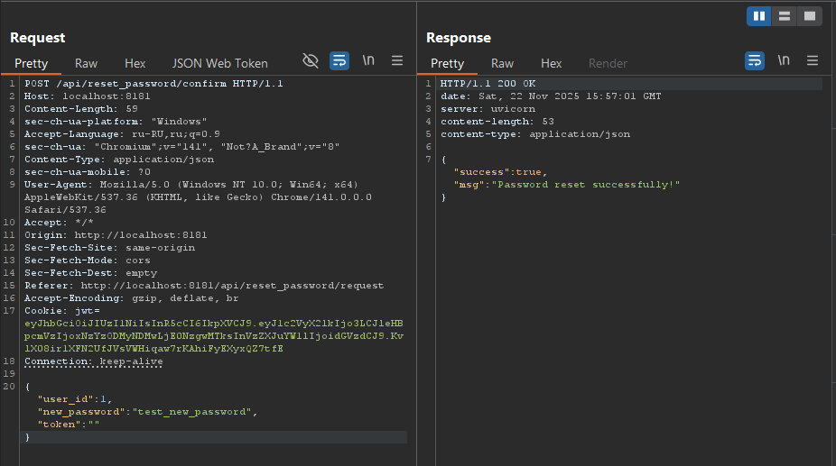
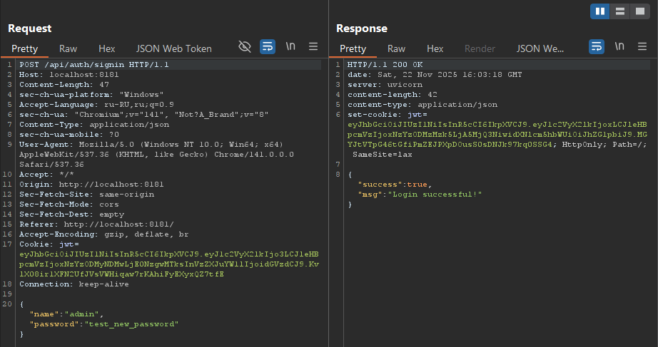

## web-easy-broken_reset_password

| Событие | Название | Категория |
| :------ | ---- | ---- |
| VKACTF kids 2025 | Zero to hero | web |

  
### Описание


> Автор: T1mP1v
>
Откидываюсь на спинку кресла. Смотрю на код. Опять эта история.
Тот самый момент, когда дверь якобы закрыта, но ветер её качает. Разработчики оставили щель. Не специально. Просто недоглядели.

## Решение

Веб приложение написано на FastAPI представляет из себя простой функционал логина, регистрации и  смены пароля. 
Даны исходники, соответственно проанализируем логику функции смены пароля:


Заметим что код содержит критическую ошибку в условной проверке:


``if data.token:`` Эта часть проверяет, что токен существует и не является пустым.

``data.token != valid_reset_token.token:`` Эта часть проверяет, что существующий токен НЕ равен правильному.
Если ``data.token == ""``, то условие ``if data.token`` будет ложным, тогда поскольку первая часть условия ложна, интерпретатор *Python* даже не проверяет вторую часть ``data.token != valid_reset_token.token``. Таким образом, весь блок ``if`` пропускается и без проверки **можно менять пароль любого пользователя.**
### Ход атаки

**Воспользуемся неправильной логикой проверки временного токена для смены пароля пользователя admin.**

**1. Регистрируем рандомного пользователя**



**2. Логинимся под новым пользователем**



**3. Отправим запрос на смену пароля**



Видим какие параметры передаются в *POST* запросе, воспользуемся уязвимостью в веб приложении и поменяем ``"user_id":"1" и "token":""``, тогда получим:



Успешно! Поменяли пароль пользователя с ``"user_id":"1"`` (**admin**)

**4. Логинимся под admin с новым паролем**



Успешно! Флаг лежит в профиле админа. ``FLAG: vka{woow_is_broken_password_reset_logic}``


**5. Автоматизация атаки**

Для удобства и повторяемости атаки напишем небольшой скрипт, который:

  • Регистрирует нового пользователя.

  • Логинит нового пользователя.

  • Отправляет запрос на смену пароля с ``"user_id":"1" и "token":""``, меняет пароль.
  
  • Логинится под новым паролем админа, грепает флаг.


Вот пример такого [эксплойта](./splo.py).

### Флаг

```
vka{woow_is_broken_password_reset_logic}
```