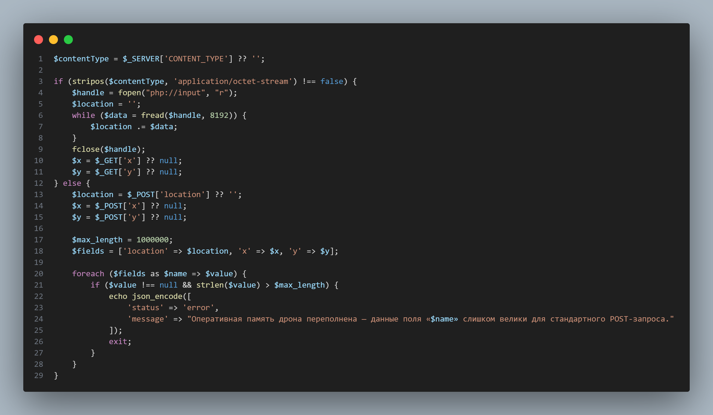
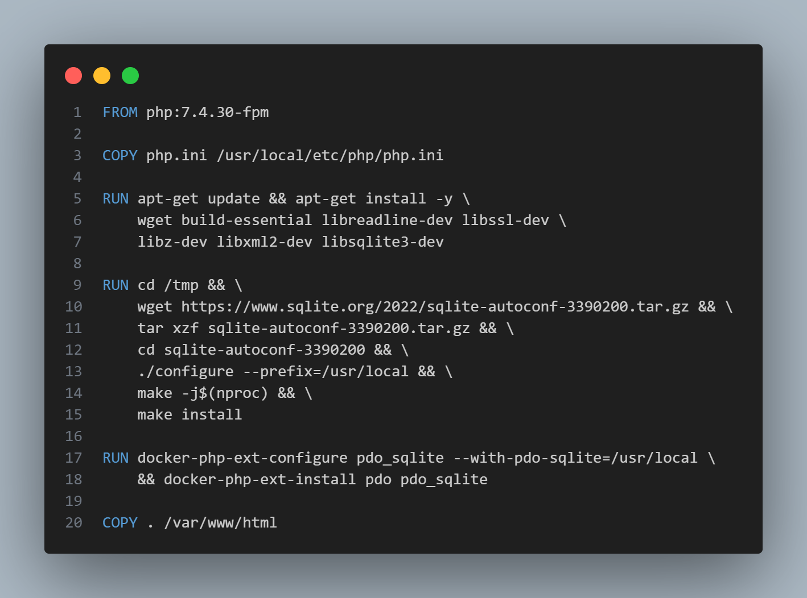

## web-medium-php_sql

| Событие | Название | Категория | Сложность |
| :------ | ---- | ---- | ---- |
| VKACTF 2025 | Drone recone | web | medium |

  
### Описание


> Автор: T1mP1v
>
После череды провалов в работе дронов-разведчиков Захаров получил доступ к прототипу системы поиска по локациям. Интерфейс позволяет указывать координаты точки интереса и отправлять туда дрон. Однако ключевая информация, связанная с засекреченными объектами, остаётся скрытой.

### Решение

Веб-приложение имитирует интерфейс системы управления дронами. Пользователь указывает координаты и выбирает локацию, куда будет направлен дрон-разведчик. Отправка данных на сервер может происходить двумя способами:

• в форме обычного `POST`-запроса, где координаты `x, y` и название локации `location` передаются в теле запроса (причем на длину параметров стоит **ограничение 1000000 байт**).

• в виде бинарного потока `Content-Type: application/octet-stream`, В этом случае только название локации передаётся в теле запроса, а координаты `x, y` подставляются как `GET`-параметры.

*Вот фрагмент кода который это демонстрирует:*



Также из `Dockerfile` видно, что используется `SQLite` *версии 3.39.2* и `PHP` *7.4.30* — именно эта связка подтверждает наличие уязвимости [CVE-2022-31631](https://bugs.php.net/bug.php?id=81740). 



Уязвимость возникает из-за **некорректного поведения функции `PDO::quote()` при использовании драйвера `pdo_sqlite`**. В норме эта функция должна безопасно экранировать строку для подстановки в SQL-запрос. Однако при определённых условиях (в частности, при очень большом размере строки, переданной в функцию `PDO::quote()`). так, например, отправив строку длинной *"A * 0x80000000"* , функция вернет:
```
'A 
```
или просто
```
'
```

Это поведение позволяет **влиять на структуру SQL-запроса**, отправив чрезмерно длинное значение в параметр `location`, а затем — **`SQL`-инъекцию** в параметр `x`. Из-за незакрытой кавычки от `location`, значение `x` будет восприниматься как часть `SQL`-кода, что даёт **возможность выполнять произвольные `SQL`-выражения.**

## Ход атаки

Воспользуемся особенностями реализации и уязвимостью `CVE-2022-31631`, чтобы обойти механизм фильтрации и выполнить произвольный `SQL`-запрос.

**1. Обход ограничения на POST-запрос**

При использовании `Content-Type: application/octet-stream`, сервер **не проверяет длину тела** запроса. Это позволяет **обойти ограничение в 1 000 000 байт** на параметр `location`, которое действует только при обычных `POST`-запросах.

**2. Инициация уязвимости**

Мы отправляем крайне длинную строку в теле запроса, а именно *"'A' * 0x80000000"*  в параметр `location`. Из-за бага в `pdo_sqlite`, функция `PDO::quote()` обрезает и не завершает такую строку закрывающей кавычкой, получим:
```
location = "'A"
```

В результате, с помощью параметра `x` мы можем **изменить структуру `SQL`-запроса**.

**3. Инъекция полезной нагрузки через x**

Так как поле `x` добавляется сразу после `location` в `SQL`-запрос, мы можем передать туда `UNION SELECT`, и он будет интерпретирован как часть запроса. [Структура таблицы подсказывает](./images/table_objects.png), что флаг находится в таблице `objects`, в столбце `flag`.

Учитывая что `location = "'A"`, чтобы **получить флаг**, достаточно подставить следующее:
```
x = " OR 1=1 UNION SELECT 1, flag, 1, 1 FROM objects WHERE flag IS NOT NULL -- "
```
Весь итоговый `SQL`-запрос после подстановки параметров может выглядеть так:

```sql
SELECT id,name,info,image FROM objects WHERE name = 'A AND x = ' OR 1=1 UNION SELECT 1, flag, 1, 1 FROM objects WHERE flag IS NOT NULL -- ' AND y = '112'
```

Благодаря `UNION`, возвращается одна строка, содержащая **флаг** (так как используется `fetch(PDO::FETCH_ASSOC)` — выводится только один объект).

**4. Автоматизация атаки**

Для удобства и повторяемости атаки напишем небольшой скрипт, который:

  • Отправляет `POST`-запрос с заголовком `Content-Type: application/octet-stream` и очень большим телом (*"'A' * 0x80000000"*) в параметр `location`.

  • Передаёт параметр `x` с инъекцией `UNION SELECT`, чтобы достать **флаг** с [таблицы](./images/table_objects.png).

  • Парсит ответ сервера и выводит найденный **флаг**. 

Вот пример такого [эксплойта](./splo.py), написанного на Python.

### Флаг

```
vka{quote_this_mess_baby}
```